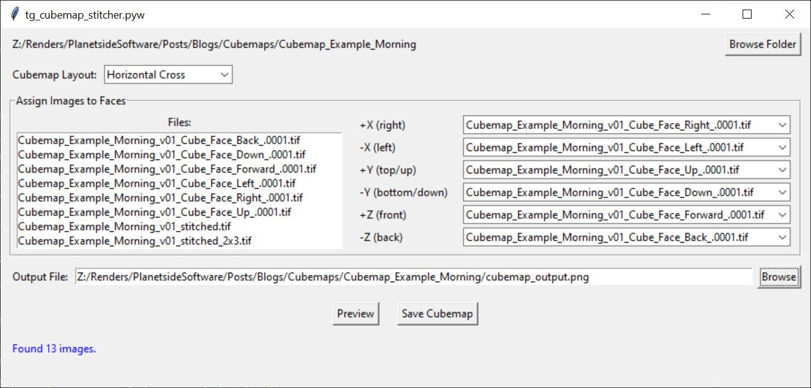
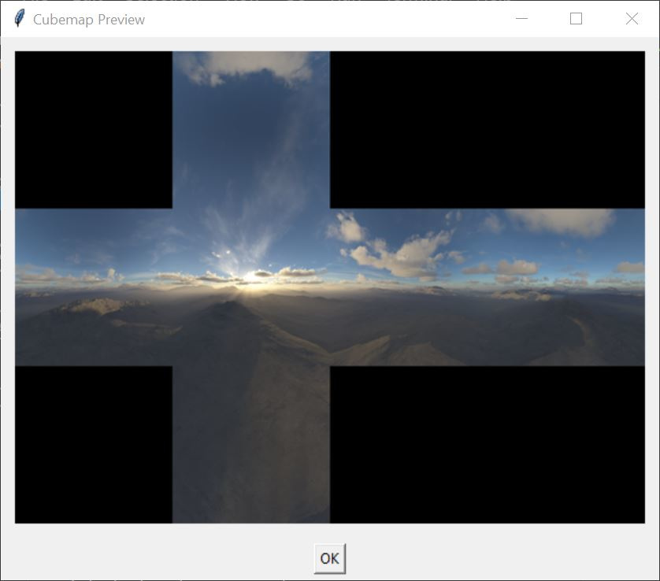

# tg-cubemap-cameras
A collection of cubemap utilities including tg_cubemap_cameras and tg_cubemap_stitcher.

## tg-cubemap-cameras.pyw
### Description
This script adds six camera nodes and a render node to the Terragen project in order to render cubemap images based on the source camera’s position.

### Requirements
The toolkit requires a version of Terragen 4 with the remote procedure call (RPC) feature.  
It also requires the Python programming language and the modules listed below.  

Terragen 4 Professional (v4.6.31 or later)  
or Terragen 4 Creative (4.7.15 or later)  
or Terragen 4 Free (4.7.15 or later)  
https://planetside.co.uk/  

Python  
https://www.python.org/  

Tom’s Obvious, Minimal Language module  
https://pypi.org/project/toml/  

terragen-rpc  
https://github.com/planetside-software/terragen-rpc  

### Installation
This script is included with the redmaw-tg-toolkit repository.  No additional installation steps are necessary.  See the Installation notes for the redmaw-tg-toolkit repository.  
This script shows up under the Cameras tab of the tg_dashboard.pyw script and has been assigned the keyboard shortcut “6”.  
There is no UI for this script.  

### Usage
Select the camera node in the Node Network window that you wish the cubemap cameras to be based on, then run the script. 

Six cubemap cameras will be created and inherit the position value of the selected camera. Each camera will face a different direction: forward, backward, left, right, up and down.  

A render node is added to the project with the forward facing cubemap camera assigned to it.  

For more information please see this blog post about setting up cubemaps: URL  

### Known Issues
By default, the RPC feature stacks newly created nodes on top of each other in the center of the Node Network window.  You can force the Terragen UI to refresh itself by clicking a button in the top Toolbar, like “Node Network”, and when refreshed, the new nodes will no longer be stacked on one another.

### Reference
Blog post URL here

## tg_cubemap_stitcher.pyw
### Description
This script stitches together six cubemap images into a single cubemap texture image.  You can choose the layout of the cubemap texture image and which cubemap image is assigned to each face of the cube.

### Requirements
This script does not require the terragen_rpc_module, only Python and the tkinter module. 

Python  
https://www.python.org/  

### Installation
This script is included with the redmaw-tg-toolkit repository.  No additional installation steps are necessary.  See the Installation notes for the redmaw-tg-toolkit repository. This script shows up under the Utilities tab of the tg_dashboard.pyw script and has been assigned the keyboard shortcut “Shift-s”.  

### Usage
When run, the UI presents controls to select the location of the cubemap images, the layout of sticted cubemap, and the assignment of the cubemap images to the cube's faces.  You can preview and save the stitched image as well.

<ul>
<li>
Use the <b>Browse</b> button to navigate to the folder containing the cubemap images. </li>
<li>
Select the <b>Cubemap Layout</b> that the individual cubemap images will be stitched into. </li>
<li>Assign an image to each of the cube faces. </li>
<li>Click the <b>Browse</b> button and set the output path, filename and filetype.</li>
<li>Click the <b>Preview<b> button to see the stitched image </li>
    
<li> Click the <b>Save Cubemap</b> button to save the stitched cubemap to disk. </li>

</ul>

### Reference
Blog post URL here