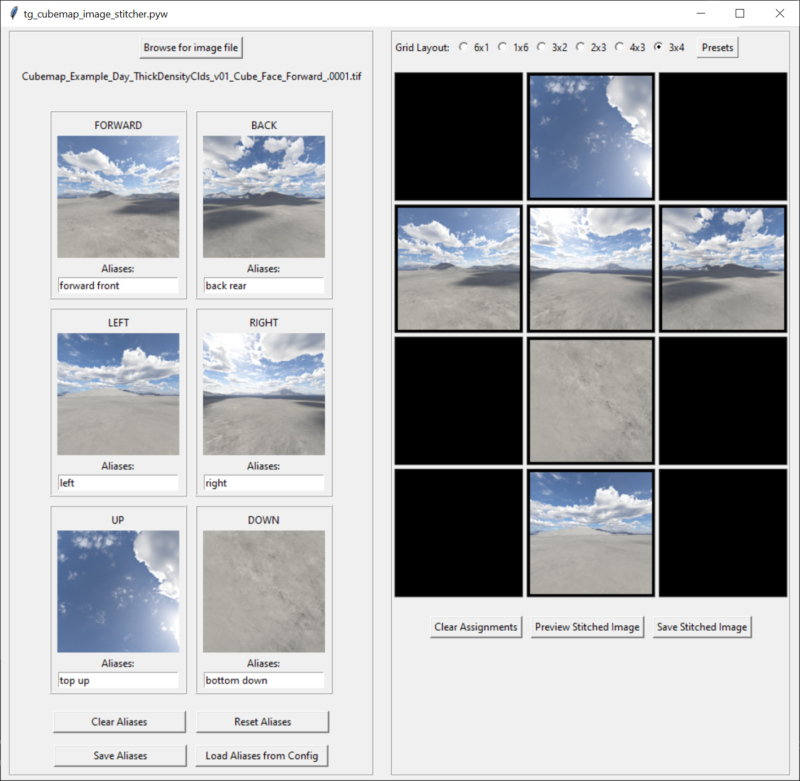
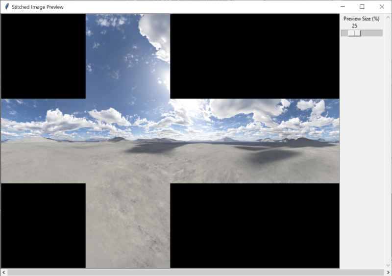

# tg-cubemap-cameras
A collection of cubemap utilities including tg_cubemap_cameras and tg_cubemap_image_stitcher.

## tg-cubemap-cameras.pyw
### Description
This script adds six camera nodes and a render node to the Terragen project in order to render cubemap images based on the source camera’s position.

### Requirements
The toolkit requires a version of Terragen 4 with the remote procedure call (RPC) feature.  
It also requires the Python programming language and the modules listed below.  

Terragen 4 Professional (v4.6.31 or later)  
or Terragen 4 Creative (4.7.15 or later)  
or Terragen 4 Free (4.7.15 or later)  
https://planetside.co.uk/  

Python  
https://www.python.org/  

Tom’s Obvious, Minimal Language module  
https://pypi.org/project/toml/  

terragen-rpc  
https://github.com/planetside-software/terragen-rpc  

### Installation
This script is included with the redmaw-tg-toolkit repository.  No additional installation steps are necessary.  See the Installation notes for the redmaw-tg-toolkit repository.  
This script shows up under the Cameras tab of the tg_dashboard.pyw script and has been assigned the keyboard shortcut “6”.  
There is no UI for this script.  

### Usage
Select the camera node in the Node Network window that you wish the cubemap cameras to be based on, then run the script. 

Six cubemap cameras will be created and inherit the position value of the selected camera. Each camera will face a different direction: forward, backward, left, right, up and down.  

A render node is added to the project with the forward facing cubemap camera assigned to it.  

For more information please see this blog post about setting up cubemaps: URL  

### Known Issues
By default, the RPC feature stacks newly created nodes on top of each other in the center of the Node Network window.  You can force the Terragen UI to refresh itself by clicking a button in the top Toolbar, like “Node Network”, and when refreshed, the new nodes will no longer be stacked on one another.

### Reference
Blog post URL here

## tg_cubemap_image_stitcher.pyw
### Description
This script stitches together six cubemap images into a single cubemap texture image.  You can choose the layout of the cubemap texture image and which cubemap image is assigned to each face of the cube. While designed for using images rendered from Terragen, you're not limited by this.  The script is generic enough to accept images created by other applications.

### Requirements
This script does not require the terragen_rpc_module, but does require all the Python modules listed in the installaton notes of the redmaw-tg-toolkit. 

Python  
https://www.python.org/  

### Installation
This script is included with the redmaw-tg-toolkit repository.  No additional installation steps are necessary.  See the Installation notes for the redmaw-tg-toolkit repository. This script shows up under the Utilities tab of the tg_dashboard.pyw script and has been assigned the keyboard shortcut “Shift-s”.  

### Usage
When run, the UI presents controls to select the location of the saved cubemap images on disk, which image is assigned to a particular view, and the layout of stitched cubemap texture image.  You can preview and save the stitched image as well.

<ul>
<li>Use the <b>Browse</b> button to navigate to the folder containing the cubemap images. </li>
<li>Select one of the cubemap images in the sequence.  It doesn't matter which one. </li>
<li>The script automatically assigns the first cubemap image in the sequence that matches the text in the <b>Aliases</b> field.  Common aliases are provided by default.  You can append to or overwrite these search patterns.</li>
<li>Right clicking on a face, allows you to load any individual image you like to that face.</li>
<li>Left clicking on a face will hightlight the thumbnail image and allow you to assign that individual image to any of the grid layout positions.</li>
<li><b>Clear Aliases</b> clears all the text fields.</li>
<li><b>Reset Aliases</b> resets all the text fields to the default search pattern text.</li>
<li><b>Save Aliases</b> saves all the current search patterns to a config file.</li>
<li><b>Load Aliases from config</b> loads the search patterns from the config file and replaces all the existing search patterns.</li>
<li>The <b>Grid Layout</b> buttons allow you to choose the column and row format for the cubemap texture image.</li>
<li>The <b>Presets</b> button allows you to select from common column and row formats and cubemap texture layouts, including known image rotations.</li>

<li>Right clicking on an grid cell opens a context menu where you can clear or assign images and perform flips and rotations.</li>

<li><b>Clear Assignments</b> removes all of the images assigned to a grid cell and resets any flip or rotations values.</li>
<li><b>Preview Stitched Image</b> opens a preview window showing the stitched image.</li>

<li><b>Save Stitched Image</b> saves the stitched image to disk.</li>

</ul>

### Reference
Support Diaries: Cubemaps  
https://planetside.co.uk/blog/support-diaries-cubemaps/